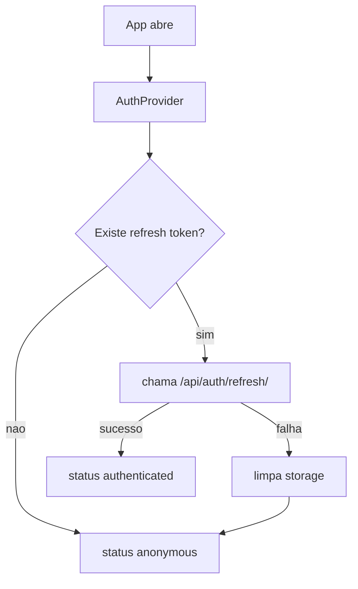

# Explora+ Frontend

Frontend do Explora+, construido com Expo + React Native e hoje orientado ao fluxo principal do MVP:

- autenticacao
- planner de rota turistica
- mapa com POIs
- biblioteca pessoal de lugares
- perfil basico do usuario

O projeto roda em React Native, mas o caminho mais usado e validado hoje e **Expo Web**, porque ele facilita a demonstracao local e a integracao com o backend do planner.

## Sumario

- [Visao Geral](#visao-geral)
- [Estado atual do MVP](#estado-atual-do-mvp)
- [Stack e dependencias](#stack-e-dependencias)
- [Estrutura do repositorio](#estrutura-do-repositorio)
- [Arquitetura da aplicacao](#arquitetura-da-aplicacao)
- [Fluxo de navegacao](#fluxo-de-navegacao)
- [Integracao com o backend](#integracao-com-o-backend)
- [Subindo o projeto](#subindo-o-projeto)
- [Variaveis de ambiente](#variaveis-de-ambiente)
- [Fluxo por tela](#fluxo-por-tela)
- [Mapa e planner](#mapa-e-planner)
- [Configuracoes de busca](#configuracoes-de-busca)
- [Persistencia local e autenticacao](#persistencia-local-e-autenticacao)
- [Comandos uteis](#comandos-uteis)
- [Problemas comuns](#problemas-comuns)

## Visao Geral

Hoje o frontend deixou de ser apenas um catalogo de lugares e passou a ser um cliente do planner de rotas turisticas.

O fluxo ativo e:

1. o usuario entra ou cria conta
2. a tela `Explorar` tenta reabrir a rota atual salva
3. se ainda nao existir rota, o app gera uma rota de exemplo na Paulista
4. o mapa mostra origem, destino, linha da rota e POIs
5. o usuario pode:
   - recalcular a rota
   - filtrar categorias
   - abrir detalhe de POI
   - marcar POI como visitado
   - excluir POI da rota atual
6. a aba `Lugares` mostra a biblioteca pessoal de POIs que ja apareceram em rotas
7. a aba `Perfil` permite abrir `Configuracoes de busca` para ajustar como a proxima rota sera calculada

## Estado atual do MVP

### Tabs visiveis

Arquivo: [src/navigation/TabNavigator.tsx](/C:/Users/lucas/Documents/Projects/academic/PCE/explora-plus-frontend/src/navigation/TabNavigator.tsx)

Hoje a navegacao visivel tem 3 abas:

- `Explorar`
- `Lugares`
- `Perfil`

### O que esta funcional

- login
- cadastro
- refresh automatico de token: ao abrir o app e em qualquer requisicao com 401 (sem precisar reabrir)
- logout
- carregamento de rota atual salva
- fallback automatico para rota padrao da Paulista
- calculo de rota via backend
- mapa com rota, origem, destino, stops e POIs
- filtros `Todos`, `Cultura`, `Parques`, `Comida`
- pre-busca automatica de imagens e detalhes dos POIs em background apos a rota carregar
- modal de detalhe de POI (abre instantaneamente para POIs ja pre-buscados)
- marcar/desmarcar `ja visitado`
- excluir POI da rota atual
- biblioteca pessoal de lugares com imagens
- configuracoes personalizadas do planner por usuario

### O que existe no codigo, mas nao e o fluxo principal

Ainda existem arquivos legados no repo, como:

- [PlaceDetailScreen.tsx](/C:/Users/lucas/Documents/Projects/academic/PCE/explora-plus-frontend/src/screens/PlaceDetailScreen.tsx)
- [RouteScreen.tsx](/C:/Users/lucas/Documents/Projects/academic/PCE/explora-plus-frontend/src/screens/RouteScreen.tsx)
- [MyRoutesScreen.tsx](/C:/Users/lucas/Documents/Projects/academic/PCE/explora-plus-frontend/src/screens/MyRoutesScreen.tsx)
- [TicketsScreen.tsx](/C:/Users/lucas/Documents/Projects/academic/PCE/explora-plus-frontend/src/screens/TicketsScreen.tsx)
- [src/services/routes.ts](/C:/Users/lucas/Documents/Projects/academic/PCE/explora-plus-frontend/src/services/routes.ts)
- [src/services/tickets.ts](/C:/Users/lucas/Documents/Projects/academic/PCE/explora-plus-frontend/src/services/tickets.ts)

Eles permanecem por compatibilidade/historico, mas o README abaixo foca no fluxo ativo do MVP.

## Stack e dependencias

### Stack principal

- Expo 52
- React 18
- React Native 0.76
- React Navigation 7
- React Native Reanimated
- React Native WebView
- React Native Web

Arquivo: [package.json](/C:/Users/lucas/Documents/Projects/academic/PCE/explora-plus-frontend/package.json)

### Scripts disponiveis

```json
{
  "start": "expo start",
  "android": "expo start --android",
  "ios": "expo start --ios",
  "web": "expo start --web"
}
```

### Dependencias importantes

- `expo`
- `@react-navigation/native`
- `@react-navigation/bottom-tabs`
- `@react-navigation/native-stack`
- `react-native-webview`
- `react-native-reanimated`
- `react-native-svg`

## Estrutura do repositorio

```text
explora-plus-frontend/
|-- assets/
|-- src/
|   |-- components/
|   |   |-- MapView/               # motor visual do mapa
|   |   `-- TourPoiDetailModal.tsx # modal compartilhado de detalhe
|   |-- context/
|   |   `-- AuthContext.tsx
|   |-- features/
|   |   `-- tourRoutes/ui.ts       # labels, cores e helpers do planner
|   |-- navigation/
|   |   |-- AuthNavigator.tsx
|   |   |-- RootNavigator.tsx
|   |   |-- TabNavigator.tsx
|   |   `-- types.ts
|   |-- screens/
|   |   |-- ExploreScreen.tsx
|   |   |-- PlacesScreen.tsx
|   |   |-- ProfileScreen.tsx
|   |   |-- SearchSettingsScreen.tsx
|   |   |-- LoginScreen.tsx
|   |   |-- RegisterScreen.tsx
|   |   `-- ... telas legadas ...
|   |-- services/
|   |   |-- api.ts
|   |   |-- auth.ts
|   |   |-- me.ts
|   |   |-- tourRoutes.ts
|   |   |-- places.ts
|   |   `-- storage.ts
|   `-- theme/
|-- App.tsx
|-- app.json
|-- docker-compose.yml
|-- Dockerfile
`-- package.json
```

## Arquitetura da aplicacao

### Blocos principais

- `App.tsx`: raiz do app
- `AuthProvider`: controla sessao, refresh e token atual
- `RootNavigator`: decide entre fluxo anonimo e fluxo autenticado
- `TabNavigator`: tabs visiveis do MVP
- `services/`: camada de integracao com a API
- `MapView`: encapsula o mapa HTML/Leaflet em `WebView`/`iframe`

### Fluxo de alto nivel


### Fluxo de autenticacao



## Fluxo de navegacao

Arquivos:

- [RootNavigator.tsx](/C:/Users/lucas/Documents/Projects/academic/PCE/explora-plus-frontend/src/navigation/RootNavigator.tsx)
- [TabNavigator.tsx](/C:/Users/lucas/Documents/Projects/academic/PCE/explora-plus-frontend/src/navigation/TabNavigator.tsx)
- [types.ts](/C:/Users/lucas/Documents/Projects/academic/PCE/explora-plus-frontend/src/navigation/types.ts)

### Stack raiz

`RootNavigator` decide entre:

- `AuthNavigator`
- `Tabs`

Ele ainda mantem no stack:

- `PlaceDetail`
- `Route`
- `SearchSettings`

Mas, no MVP atual, a experiencia principal esta nas tabs.

### Tabs publicas do usuario autenticado

`RootTabParamList` atual:

- `Explore`
- `Places`
- `Profile`

## Integracao com o backend

Arquivo principal: [src/services/tourRoutes.ts](/C:/Users/lucas/Documents/Projects/academic/PCE/explora-plus-frontend/src/services/tourRoutes.ts)

### Base URL

Arquivo: [src/services/api.ts](/C:/Users/lucas/Documents/Projects/academic/PCE/explora-plus-frontend/src/services/api.ts)

```ts
export const API_URL =
  process.env.EXPO_PUBLIC_API_URL ?? "http://localhost:8080";
```

Ou seja:

- se `EXPO_PUBLIC_API_URL` existir, ela vence
- senao, o fallback local e `http://localhost:8080`

### Endpoints usados pelo frontend ativo

#### Auth

- `POST /api/auth/register/`
- `POST /api/auth/login/`
- `POST /api/auth/refresh/`
- `GET /api/me/`

#### Planner e biblioteca de lugares

- `POST /api/tour-routes/`
- `GET /api/tour-routes/current/`
- `GET /api/tour-routes/preferences/`
- `PATCH /api/tour-routes/preferences/`
- `GET /api/tour-routes/places/`
- `GET /api/tour-routes/pois/<stop_id>/`
- `PATCH /api/tour-routes/places/<stop_id>/visited/`
- `DELETE /api/tour-routes/saved/<route_id>/stops/<stop_id>/`
- `PATCH /api/tour-routes/saved/<route_id>/stops/<stop_id>/state/`

### Modelos TypeScript principais

Arquivo: [src/services/tourRoutes.ts](/C:/Users/lucas/Documents/Projects/academic/PCE/explora-plus-frontend/src/services/tourRoutes.ts)

Tipos importantes:

- `TourRouteResponse`
- `TourRoutePayload`
- `TourRoutePreferences`
- `TourRoutePlaceToPass`
- `TourRoutePoiDetail`
- `UserTourPlace`
- `TourRouteMapFeature`

## Subindo o projeto

### Caminho 1: desenvolvimento manual com Expo

### 1. Instalar dependencias

```bash
npm install
```

### 2. Criar `.env`

Copie [`.env.example`](/C:/Users/lucas/Documents/Projects/academic/PCE/explora-plus-frontend/.env.example) para `.env`.

Valor recomendado no setup atual:

```env
EXPO_PUBLIC_API_URL=http://localhost:8080
```

Observacao:

- o `.env.example` historico pode estar com `8000`
- no setup atual do backend em Docker, a porta publica da API e `8080`

### 3. Garantir backend no ar

Backend esperado:

- [http://localhost:8080/api/health/](http://localhost:8080/api/health/)

### 4. Subir frontend web

```bash
npm run web
```

O Expo pode escolher uma porta automaticamente. No setup usado pela equipe, o web costuma abrir em `8081` quando livre.

### Caminho 2: Docker

Arquivo: [docker-compose.yml](/C:/Users/lucas/Documents/Projects/academic/PCE/explora-plus-frontend/docker-compose.yml)

### 1. Subir container

```bash
docker compose up --build -d
```

### 2. Portas

No Compose atual:

- host `8082` -> container `8081`
- host `19006` -> Expo web tooling

Entao, com Docker, o frontend fica em:

- [http://localhost:8082](http://localhost:8082)

### 3. Derrubar

```bash
docker compose down
```

## Variaveis de ambiente

Arquivo base: [`.env.example`](/C:/Users/lucas/Documents/Projects/academic/PCE/explora-plus-frontend/.env.example)

| Variavel | Obrigatoria | Exemplo recomendado | Papel |
| --- | --- | --- | --- |
| `EXPO_PUBLIC_API_URL` | sim | `http://localhost:8080` | URL base da API do backend |

## Fluxo por tela

### `LoginScreen`

Arquivo: [src/screens/LoginScreen.tsx](/C:/Users/lucas/Documents/Projects/academic/PCE/explora-plus-frontend/src/screens/LoginScreen.tsx)

Papel:

- coleta `username` e `password`
- chama `signIn`
- persiste tokens em storage via `AuthContext`

### `RegisterScreen`

Arquivo: [src/screens/RegisterScreen.tsx](/C:/Users/lucas/Documents/Projects/academic/PCE/explora-plus-frontend/src/screens/RegisterScreen.tsx)

Papel:

- cria conta
- recebe `access`, `refresh` e `user`
- entra autenticado direto

### `ExploreScreen`

Arquivo: [src/screens/ExploreScreen.tsx](/C:/Users/lucas/Documents/Projects/academic/PCE/explora-plus-frontend/src/screens/ExploreScreen.tsx)

Esta e a tela principal do MVP.

Responsabilidades:

- tentar abrir a rota atual salva via `GET /api/tour-routes/current/`
- se ainda nao existir rota, gerar rota padrao:
  - origem: `Praca Oswaldo Cruz, Sao Paulo`
  - destino: `Edificio Gilbraltar, 2518, Avenida Paulista, Sao Paulo`
- permitir recalculo com dois campos:
  - `Endereco de origem`
  - `Destino`
- aplicar implicitamente as preferencias de busca salvas do usuario na proxima chamada de `POST /api/tour-routes/`
- mostrar mapa, filtros e resumo
- abrir modal de detalhe ao clicar em:
  - bolha do mapa
  - item do resumo
- permitir:
  - marcar/desmarcar visitado
  - excluir da rota atual

Estados visuais importantes:

- `searchCollapsed`: recolhe o formulario de busca
- `summaryCollapsed`: recolhe o resumo da rota

Filtros:

- `Todos`
- `Cultura`
- `Parques`
- `Comida`

Resumo das secoes:

- metricas principais
- `Paradas da rota`
- `Ja visitados`
- `Sugestoes extras`

### `PlacesScreen`

Arquivo: [src/screens/PlacesScreen.tsx](/C:/Users/lucas/Documents/Projects/academic/PCE/explora-plus-frontend/src/screens/PlacesScreen.tsx)

Funciona como a biblioteca pessoal de lugares do usuario.

Fonte de dados:

- `GET /api/tour-routes/places/`

Tambem busca:

- `GET /api/tour-routes/current/` para saber o `saved_route_id` atual

Filtros disponiveis:

- `Todos`
- `Visitados`
- `Nao visitados`
- `Rota atual`
- `Excluidos`

Regras visuais:

- itens na rota atual mostram badge numerico
- itens visitados ficam com opacidade reduzida
- itens excluidos vao para o fim e ficam em preto e branco
- a ordem vem do backend e os filtros nao reordenam, apenas escondem/mostram

### Como o frontend identifica um lugar

No fluxo novo do planner:

- o frontend recebe `stop_id` do backend
- esse `stop_id` e a chave usada para:
  - abrir detalhes do POI
  - marcar/desmarcar visitado
  - excluir da rota atual
  - localizar o mesmo lugar na aba `Lugares`

Entao, para a UI, o `stop_id` e a identidade estavel do lugar dentro do ecossistema de rotas.

### `ProfileScreen`

Arquivo: [src/screens/ProfileScreen.tsx](/C:/Users/lucas/Documents/Projects/academic/PCE/explora-plus-frontend/src/screens/ProfileScreen.tsx)

MVP enxuto:

- avatar
- nome
- e-mail
- member since
- botao de engrenagem para `Configuracoes de busca`
- botao `Sair da conta`

O profile puxa:

- `GET /api/me/`

### `SearchSettingsScreen`

Arquivo: [src/screens/SearchSettingsScreen.tsx](/C:/Users/lucas/Documents/Projects/academic/PCE/explora-plus-frontend/src/screens/SearchSettingsScreen.tsx)

Papel:

- carregar as preferencias atuais com `GET /api/tour-routes/preferences/`
- permitir salvar novas preferencias com `PATCH /api/tour-routes/preferences/`
- manter a regra de pelo menos uma categoria ativa
- explicar para o usuario que a mudanca vale so na proxima busca

Controles visiveis:

- switches:
  - `Cultura`
  - `Parques`
  - `Comida`
- presets:
  - `Distancia entre POIs`: `75m`, `100m`, `150m`
  - `Raio maximo de busca`: `150m`, `250m`, `400m`

Comportamento importante:

- salvar nessa tela nao recalcula a rota atual
- `ExploreScreen` continua mostrando a rota salva anterior
- as novas preferencias entram quando o usuario toca `Gerar rota` novamente

## Mapa e planner

### Componente de mapa

Arquivos:

- [src/components/MapView/index.tsx](/C:/Users/lucas/Documents/Projects/academic/PCE/explora-plus-frontend/src/components/MapView/index.tsx)
- [src/components/MapView/index.web.tsx](/C:/Users/lucas/Documents/Projects/academic/PCE/explora-plus-frontend/src/components/MapView/index.web.tsx)
- [src/components/MapView/html.ts](/C:/Users/lucas/Documents/Projects/academic/PCE/explora-plus-frontend/src/components/MapView/html.ts)
- [src/components/MapView/types.ts](/C:/Users/lucas/Documents/Projects/academic/PCE/explora-plus-frontend/src/components/MapView/types.ts)

O mapa e renderizado com HTML embutido:

- no mobile/native: dentro de `WebView`
- na web: dentro de `iframe`

Isso permite:

- desenhar o GeoJSON/linhas do planner
- tratar clique em marcador via `postMessage`
- manter o mesmo motor visual entre plataformas

### Como o mapa e montado

Na `ExploreScreen`, o backend devolve:

- `route`
- `map`

O frontend usa `map.features` como fonte principal para:

- `MapMarker[]`
- `MapPolyline[]`

Kinds tratados no frontend:

- `route_tour`
- `route_direct`
- `origin`
- `destination`
- `stop`
- `poi`

Estados tratados:

- `active`
- `visited`

### Taxonomia ativa

Arquivo: [src/features/tourRoutes/ui.ts](/C:/Users/lucas/Documents/Projects/academic/PCE/explora-plus-frontend/src/features/tourRoutes/ui.ts)

Categorias canonicamente suportadas:

- `culture`
- `park`
- `food`

Labels visiveis:

- `Cultura`
- `Parques`
- `Comida`

## Configuracoes de busca

As configuracoes de busca pertencem ao planner e sao persistidas por usuario autenticado no backend.

Defaults atuais:

- categorias: `Cultura`, `Parques`, `Comida` ligadas
- distancia entre POIs: `100m`
- raio maximo de busca: `250m`

Presets disponiveis:

- distancia entre POIs: `75m`, `100m`, `150m`
- raio maximo de busca: `150m`, `250m`, `400m`

Impacto pratico:

- desligar uma categoria impede que ela entre na busca automatica de novos POIs
- aumentar a distancia entre POIs tende a deixar a rota menos densa em paradas
- aumentar o raio maximo permite considerar pontos mais afastados da linha base

Regra temporal:

- a rota atual salva nao muda ao salvar preferencias
- `GET /api/tour-routes/current/` continua reabrindo a ultima rota conhecida
- apenas a proxima chamada de `POST /api/tour-routes/` passa a refletir essas configuracoes

## Persistencia local e autenticacao

### `AuthContext`

Arquivo: [src/context/AuthContext.tsx](/C:/Users/lucas/Documents/Projects/academic/PCE/explora-plus-frontend/src/context/AuthContext.tsx)

O contexto faz:

- bootstrap da sessao
- refresh do access token ao abrir o app
- persistencia de usuario e tokens
- logout

### Storage

Arquivo: [src/services/storage.ts](/C:/Users/lucas/Documents/Projects/academic/PCE/explora-plus-frontend/src/services/storage.ts)

No web, usa:

- `window.localStorage`

Fallback:

- memoria em runtime se `localStorage` nao existir

Chaves usadas:

- `explora.auth.access`
- `explora.auth.refresh`
- `explora.auth.user`

### `api.ts`

Arquivo: [src/services/api.ts](/C:/Users/lucas/Documents/Projects/academic/PCE/explora-plus-frontend/src/services/api.ts)

Responsabilidades:

- aplicar `Authorization: Bearer ...` quando houver token
- serializar/deserializar JSON
- centralizar `ApiError`
- expor `getHealth`

## Comandos uteis

### Dependencias

```bash
npm install
```

### Desenvolvimento

```bash
npm run start
npm run web
npm run android
npm run ios
```

### Verificacao de tipos

Hoje nao existe script de teste automatizado configurado no `package.json`.

A checagem principal usada no projeto e:

```bash
npm exec tsc -- --noEmit
```

### Docker

```bash
docker compose up --build -d
docker compose down
docker compose logs -f frontend
```

## Problemas comuns

### 1. Token expirado durante o uso

O app renova o token automaticamente em qualquer resposta 401 usando o refresh token em storage.

Se o refresh token tambem estiver expirado (padrao SimpleJWT: 1 dia):

- o app limpa a sessao automaticamente
- basta fazer login novamente

### 2. Frontend abre, mas nada carrega do backend

Cheque:

- `EXPO_PUBLIC_API_URL`
- backend no ar em `http://localhost:8080`
- `GET /api/health/` respondendo

### 3. Docker do frontend abre em porta diferente do backend

Isso e esperado:

- backend: `8080`
- frontend Docker: `8082`

### 4. `.env.example` aponta para `8000`

No estado atual do projeto, use:

```env
EXPO_PUBLIC_API_URL=http://localhost:8080
```

### 5. Algumas telas/servicos parecem nao bater com o MVP atual

Isso acontece porque ainda existem artefatos legados no repo.

Para o fluxo real de hoje, priorize:

- `ExploreScreen`
- `PlacesScreen`
- `ProfileScreen`
- `tourRoutes.ts`
- `AuthContext.tsx`

## Relacao com os outros repos

Este frontend foi pensado para rodar junto com:

- `explora-plus-backend`
- `explora-plus-docs`

Se voce esta fazendo onboarding completo, o ideal e ler este README junto com o README do backend, porque o fluxo principal do app depende diretamente do contrato de `tour_routes`.
